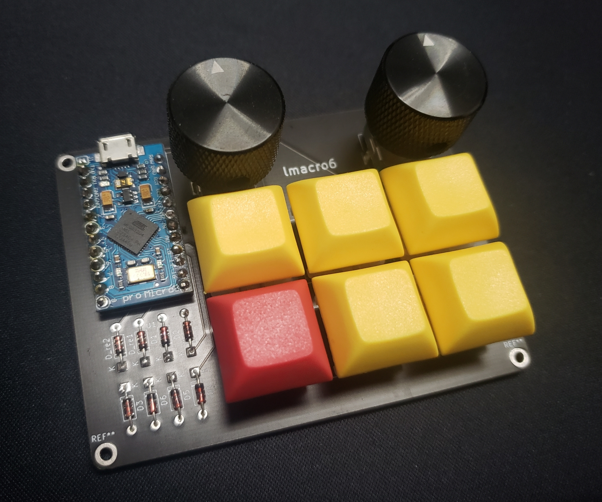

# LMACRO6

My custom macropad



## Default keymap

```plaintext
| F20            |            | Mute        |
| Ctrl + F12     | Alt + Left | Alt + Right |
| Ctrl + Alt + T |            |             |

* Left rotary encoder: Switch layer
* Right rotary encoder: Volume up/down

```

### useful macros (config via VIA)

* Open terminal in a directory (Nautilus Ubuntu): {KC_F10}{500}{KC_LALT,KC_E}
